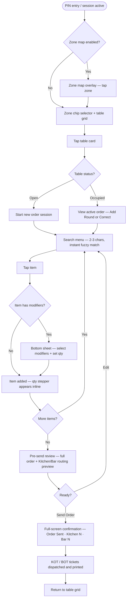
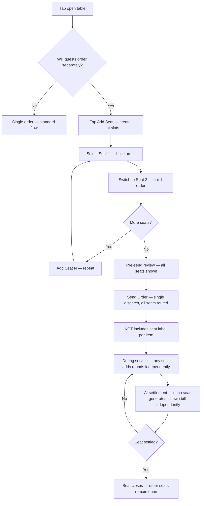
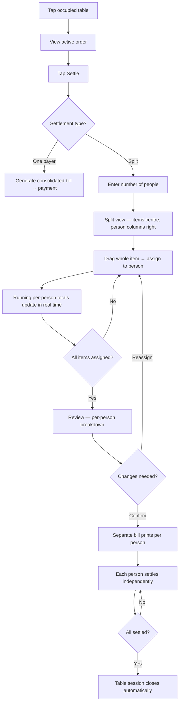
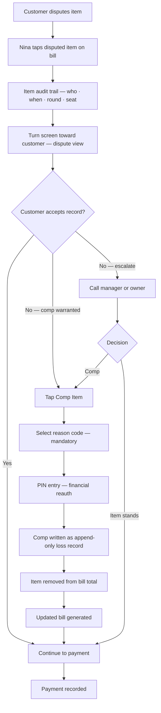
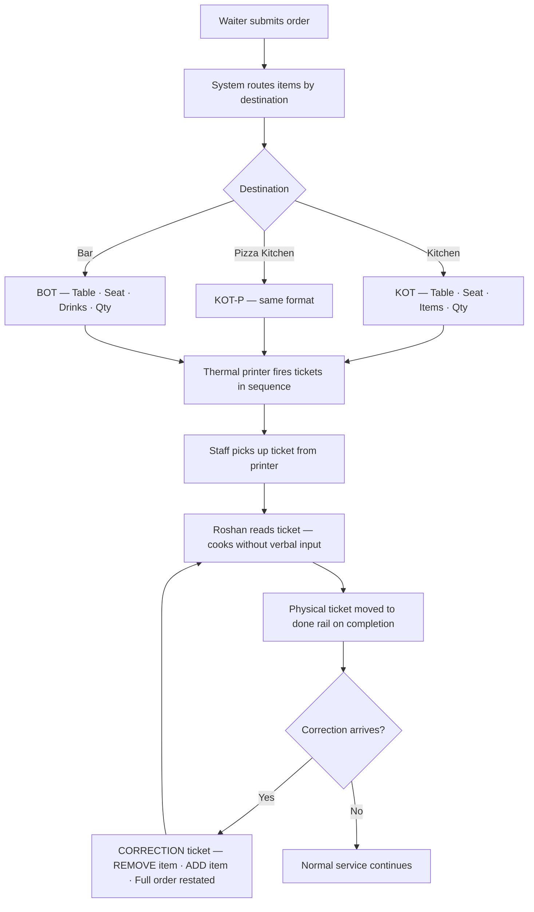
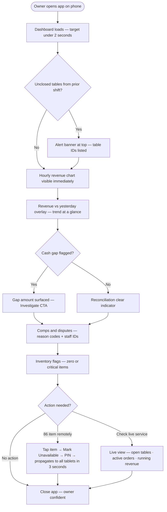

# UX Design Specification — Carpe Diem Restaurant Management System

**Author:** Teran
**Date:** 2026-05-17

---

## Executive Summary

### Project Vision

The Carpe Diem Restaurant Management System (CDRMS) replaces a fully manual beach restaurant operation where the owner is simultaneously the audit system, fraud detector, inventory watcher, and shift supervisor. The core UX mandate is structural: *the path of least resistance must be the honest path.* Order recording must feel like the same action as taking the order — not a second step — or staff will route around it under pressure.

The system is a Next.js PWA deployed locally (Docker, LAN-first), running on shared tablets for waitstaff, a dedicated display for kitchen, and a mobile browser for the owner. Internet outage has zero impact on daily operations.

### Target Users

**Nina — Waitstaff**
Works outdoors across 4 zones, frequently in direct sunlight on a shared tablet. Speed-optimized and habit-driven. Will adopt the system only if it matches or beats her verbal-order speed. Her core need is *zero-decision flow* — she should never have to think during order entry. Personalization (zone memory, per-user modifier shortcuts) directly drives adoption.

**The Owner**
Monitors remotely from a mobile browser. Primary concern is operational integrity — every transaction recorded, every cash gap visible, every comp logged with reason. Needs the morning dashboard to load under 2 seconds on mobile and immediately surface unclosed sessions from the prior night. Values friction *between* users on shared devices to prevent PIN-sharing and preserve audit attribution.

**Roshan — Kitchen Staff**
Works at a fixed station in a loud, high-pressure environment. Interacts with the system only through printed ESC/POS tickets (Carpe Diem v1) or a future always-on KDS display. Needs ticket language to match kitchen vocabulary (operational names, not customer-facing menu language). The kitchen display must never require authentication, session management, or manual waking — it is always on, always showing the live ticket queue.

### Key Design Challenges

**1. Zero-Decision Flow for Waitstaff**
Speed under pressure isn't about tap count alone — it's about cognitive load. The system must minimise decisions during order entry: remember the waiter's last active zone, surface the most-used modifiers first, and use search as the primary menu navigation path. Any moment of hesitation creates the conditions for verbal bypass.

**2. Three Separate Menu Navigation Problems**
The 100+ item menu presents distinct challenges per user: waitstaff need fast item search and one-tap modifier entry (two taps maximum); the owner needs to 86 an item remotely in under 10 seconds with immediate propagation to all devices; kitchen needs ticket item names to match operational vocabulary, not customer-facing menu language.

**3. Error Recovery in Bill Splitting**
Mid-settlement drag-and-drop splitting happens while a customer watches with card in hand. The UX must provide obvious visual feedback for mistakes, easy undo, and a confirm step before printing. The split action itself is a logged event — the owner needs to reconstruct the original merged order and item assignments for any post-payment dispute.

**4. Device Role–Based Authentication**
Three incompatible auth needs exist across device types: waitstaff need frictionless re-entry with state preservation (zone memory, in-progress order survival on user switch); the owner requires friction between users to prevent PIN-sharing and preserve audit integrity; the kitchen display requires no authentication — always on, no session timeout, never requires a tap to wake.

**5. Outdoor Visibility**
Waitstaff use tablets in direct sunlight on a beach. High-contrast design is a functional requirement, not a visual preference. Pastels, low-saturation palettes, and fine typography will fail in this environment.

### Design Opportunities

**1. Zone Map as Spatial Primary Entry**
A visual zone selector using a beach-layout metaphor makes table selection spatially intuitive and communicates active zone at a glance. Must use high-contrast colors suitable for outdoor sunlight. Zone selection should persist across the waiter's session — returning to the same zone requires zero taps.

**2. Per-User Configurable Modifier Shortcuts**
Pre-set modifier shortcuts per item category reduce modifier entry to one tap. Personalisation matters: each waiter pins their own most-used modifiers (not a global default). Personalisation is the mechanism that drives genuine adoption over time.

**3. Owner Dashboard as Operational Command Center**
The morning dashboard is the proof-of-concept that earns the owner's trust to step away. Design priority: loads under 2 seconds on mobile; surfaces unclosed sessions from prior night first; shows revenue, cash gap, comps, and inventory flags in a single unscrolled view. This screen is used under low-stress conditions (morning review) and high-stress conditions (live monitoring during a shift away from the restaurant) — it must work equally well for both.

**4. Customer-Facing Dispute View**
When a customer disputes a bill, the waiter turns the tablet toward them. That screen must look official and readable — a clean timeline ("Item ordered at 7:42pm · Round 2 · Assigned to you") not a developer audit log. The UX should de-escalate the moment, not add to it.

---

## Core User Experience

### Defining Experience

The defining experience of CDRMS is the order submission loop: a waiter selects a zone, opens a table, builds a multi-item order, and submits — all in under 20 seconds, with automatic routing to the correct destinations. This loop is the system's heartbeat. Every UX decision exists to protect its speed and reliability.

### Platform Strategy

CDRMS is a Next.js PWA (Progressive Web App) running across three distinct device contexts from a single codebase:

- **Waitstaff tablets** — touch-first, shared devices, outdoor use (direct sunlight), LAN-connected
- **Owner mobile browser** — remote access via Tailscale VPN, used under low-stress (morning review) and high-stress (live monitoring during a shift away) conditions
- **Kitchen display** — always-on, no authentication, no session management, KDS mode when enabled

All core operations (order entry, ticket printing, bill generation, payment recording) run fully over the restaurant LAN. Internet outage has zero operational impact. Owner remote dashboard access requires Tailscale connectivity but is non-blocking for restaurant operations.

### Effortless Interactions

These interactions must require zero conscious thought after day one:

- **Zone + table selection** — spatial and immediate; feels like pointing at the table, not navigating a list
- **Item search** — one typed word surfaces the right item; browsing by category is the fallback, not the primary path
- **Order submission** — one tap dispatches to all destinations simultaneously; confirmation is immediate and unambiguous
- **User switching** — tap a name, enter PIN, system restores the previous state (zone, any in-progress order) for that user
- **Bill generation** — one tap from any active order view; single or split paths are equally accessible

### Critical Success Moments

1. **The 18-second order (Day 1)** — Nina submits a complex rooftop order before the first shift ends. Speed matched verbal habit. The system earned adoption.
2. **The green confirmation** — "Order sent — Kitchen (2), Bar (3)." Nina is already walking back to the table. The tickets are printing. No follow-up action needed.
3. **The first morning dashboard** — The owner opens his phone at 7am. Revenue, cash gap, comps, inventory flags — one screen, under 2 seconds. No calls made.
4. **The calm dispute** — Customer disputes an item. Nina turns the screen: "Item ordered at 7:42pm · Round 2 · Assigned to you." The record speaks. The moment de-escalates without argument.

### Experience Principles

1. **Zero-decision flow** — Every interaction is so obvious no one has to think. Hesitation is a UX failure, not a user failure.
2. **Confidence through confirmation** — Every action produces immediate, unambiguous feedback. No action disappears silently.
3. **Roles don't constrain — records do** — Any staff member can perform any operation. The audit trail, not the UI, enforces accountability.
4. **The honest path is the fast path** — The system's efficiency is its enforcement mechanism. Recording is faster than not recording.
5. **Device context is identity** — Waiter tablet, owner phone, and kitchen display are three different experiences with different auth models, density, and interaction patterns — unified by one codebase.

---

## Design Notes (PRD Amendments — Inform Steps 10–12)

### Authentication Mode Configuration

**Decision:** Staff session management is configurable per tenant via `auth_mode` flag. This is a SaaS requirement — different restaurant types have genuinely different needs.

**Four modes:**
- `session_persistent` — Long session (15–60 min timeout). Fine dining, dedicated servers.
- `session_short` — Short session (default 5 min idle) + financial reauth. Carpe Diem default.
- `per_transaction` — PIN at start of each new order. QSR/high-volume.
- `per_action` — PIN for every write action. Maximum accountability.

**Supporting flags:** `session_timeout_minutes` (configurable), `financial_action_reauth` true/false.

**Carpe Diem config:** `session_short` · 5 min · `financial_action_reauth: true`

**UX implications for Steps 10–12:**
- Order entry flow: PIN pad appears at session start (or per-transaction/per-action depending on mode)
- Bill generation + payment recording: PIN confirmation step always present when `financial_action_reauth: true`
- Each action in audit trail carries its own `staff_id` — attribution is per-action, not per-session
- System configuration screen (Owner): auth mode selector + timeout input + financial reauth toggle
- No "Switch User" button needed in `session_short` and `per_transaction` modes — natural expiry handles it
- Kitchen display: exempt from all auth modes — always-on, no session

---

## Desired Emotional Response

### Primary Emotional Goals

**Nina (Waitstaff) — Confidence**
Nina must feel in control, not cautious. The moment order entry creates anxiety — fear of selecting the wrong item, fear of losing work, fear of slowing down — she reverts to verbal habits. The dominant emotion during every order interaction must be quiet confidence: "I know what I'm doing, I know it worked."

**The Owner — Relief**
The owner has been the system. His current emotional state is chronic low-level anxiety — always on, always watching. CDRMS's primary job for him is to transfer that anxiety to software. The dashboard must evoke relief, not alarm. Seeing the numbers each morning should feel like confirmation that things are fine, not a scan for what went wrong.

**Roshan (Kitchen) — Certainty**
Every ticket that arrives is complete and correct. Roshan needs zero ambiguity about what to make, for which table, in what quantity. The emotional target is calm focus — not the low-grade stress of mishearing a verbal order or misreading scrawled paper.

### Emotional Journey Mapping

| Moment | Nina | Owner | Roshan |
|---|---|---|---|
| First use | Curious → Confident (if fast) / Anxious (if slow) | Hopeful → Trusting | Neutral → Settled |
| During core action | Focused, in control | Reassured (real-time view) | Calm, certain |
| After task completes | Relieved, satisfied | Confident | Accomplished |
| When something goes wrong | Supported, not blamed | Informed, empowered | Unaffected (print always arrives) |
| Returning after first week | Effortless — not even thinking | Trusting the system | Habitual |

### Micro-Emotions

**To design for:**
- **Confidence over caution** — Nina must never hesitate before tapping
- **Accomplishment at submission** — the green "Order sent" confirmation is a micro-reward, not just an acknowledgement
- **Calm authority** — when Nina turns the dispute screen toward a customer, she feels composed and backed by evidence
- **Freedom for the owner** — opening the dashboard while at a family dinner and seeing everything is normal; putting the phone away

**To actively avoid:**
- **Surveillance anxiety (staff)** — the audit trail must feel like *protection*, not monitoring. Framing in UI copy matters: "your order history" not "activity log"
- **Overwhelm (owner)** — the dashboard must be scannable in under 10 seconds; data density that requires scrolling or hunting creates anxiety, not confidence
- **Fear of irreversible mistakes (Nina)** — every destructive action (comp, split, close) needs a confirm step and visible undo where possible; errors must feel recoverable
- **Uncertainty after any action** — silent failures or ambiguous confirmations are the enemy; every tap must produce immediate, unambiguous feedback

### Design Implications

| Emotional Goal | UX Design Approach |
|---|---|
| Confidence (Nina) | Immediate feedback on every action; large tap targets; undo always available; errors non-catastrophic |
| Relief (Owner) | Dashboard hierarchy: normal state looks calm and green; alerts are prominent but not alarming; worst news surfaced first, not buried |
| Certainty (Roshan) | Tickets are large, high-contrast, unambiguous; item names match kitchen vocabulary; quantities prominent |
| Protection not surveillance | Audit trail UI copy uses possessive framing ("your orders", "this table's history"); dispute screen looks like a receipt, not a log |
| Accomplishment at submission | Order confirmation is a full-screen moment — green, clear, "Kitchen (2) · Bar (3)" — not a small toast notification |
| Freedom (Owner) | Dashboard loads under 2 seconds; status at a glance without scrolling; "everything normal" is the visual default state |

### Emotional Design Principles

1. **Confidence is earned through speed** — If the system is fast, Nina trusts it. If it hesitates, she doesn't. Performance IS emotional design for operational staff.
2. **Errors are recoverable, not catastrophic** — Every action that could go wrong has a visible path back. No tap should feel permanent without a confirm step.
3. **The record protects everyone** — Audit trail UI is framed as the staff member's ally, not management's surveillance tool. Same data, different framing.
4. **Normal looks calm** — The owner's default view should feel reassuring. Alerts stand out precisely because everything else is quiet.
5. **Completion is celebrated** — Submission, bill generation, and payment recording each get a clear, satisfying confirmation moment. Small but deliberate.

---

## UX Pattern Analysis & Inspiration

> **Design principle:** CDRMS draws influence exclusively from POS systems. Consumer app patterns (bottom tab bars, social card feeds, ride-share map metaphors) are wrong for an operational tool used by trained staff under service pressure. Every design decision is evaluated against what works in real POS environments — and against what those systems get wrong.

### POS Systems Analysis — What Each Does Well and Poorly

**Square POS**

What it does well:
- Order entry screen is always the primary screen — no navigation needed to reach it
- Large, tappable item grid with clear prices
- Clean single-bill payment flow
- Excellent offline mode with transparent sync state

What it gets wrong:
- Bill splitting is a settlement-only workaround, not a first-class order model
- No multi-destination ticket routing (one kitchen, no bar separation)
- Designed for card-first markets — cash reconciliation is an afterthought
- No meaningful fraud prevention or audit trail for staff accountability
- Poor fit for multi-zone outdoor environments

**Toast POS**

What it does well:
- Strong table management view with time-elapsed indicators per table
- Clear linear workflow: table → order → payment; no unnecessary navigation
- Good KDS integration — kitchen display is a first-class screen, not an add-on
- Context-sensitive action buttons change based on table state (not a fixed navigation bar)

What it gets wrong:
- Hardware lock-in — runs only on Toast-branded Android tablets
- Requires internet for most operations; offline mode is limited
- Setup and configuration complexity is high — not operator-friendly
- Expensive subscription + hardware cost; inaccessible for small operators
- Bill split flow is clunky — drag-and-drop does not exist; items must be manually re-entered

**Petpooja**

What it does well:
- Color-coded table status grid — open / occupied / needs attention readable at a glance
- Category-based menu browsing with horizontal scrollable tabs
- KOT/BOT routing concept — kitchen and bar tickets are separate, named, and routed
- Left sidebar navigation for landscape tablet — doesn't waste vertical screen space

What it gets wrong:
- Built on Adobe AIR — a legacy runtime discontinued by Adobe in 2020; technical debt is significant
- Desktop-first design ported to tablet — tap targets too small, hover interactions don't translate
- Captain app (waiter ordering) is a separate native app with a separate install and login
- Cloud sync is unreliable in low-connectivity environments
- Dashboard shows revenue cards only — no charts, no trend analysis, no actionable patterns
- No built-in fraud prevention or verbal-order control gate

**Lightspeed Restaurant**

What it does well:
- Detailed, chart-rich reporting dashboard — hourly revenue, category breakdown, staff performance
- Strong inventory management with par level alerts and forecasting
- Multi-location support from day one

What it gets wrong:
- Interface complexity is far beyond what a small restaurant operator can manage
- Too many clicks to complete a transaction — speed is sacrificed for feature coverage
- Expensive — pricing excludes the small/medium restaurant market
- Poor mobile experience for owner dashboard
- Overkill for single-location operations

**Oracle MICROS (enterprise)**

What it does well:
- Rock-solid order flow refined over decades of enterprise restaurant deployments
- Immutable audit trail — every action logged, no record can be altered
- Multi-destination ticket routing as a foundational concept, not a feature add-on
- Table merge and split as first-class operations

What it gets wrong:
- Requires vendor technician for installation and configuration — not self-serviceable
- $10,000+ setup cost — not accessible to independent restaurants
- Interface designed for fixed desktop terminals, not portable tablets
- No remote access or vendor-managed update model

### What CDRMS Eliminates

| POS Drawback | CDRMS Solution |
|---|---|
| Internet dependency for operations | Local-first Docker deployment — LAN only, zero internet dependency |
| Hardware lock-in | Runs on any device with a browser — no proprietary hardware |
| Poor split bill UX | Two first-class paths: upfront seat model + mid-settlement drag-and-drop |
| No fraud prevention / control gate | Kitchen and bar only produce what has a digital ticket — structural enforcement |
| No audit trail for staff accountability | Every action append-only with timestamp and staff PIN attribution |
| Clunky multi-destination routing | Explicit Kitchen / Pizza Kitchen / Bar routing per item at configuration |
| Dashboard cards only — no trend analysis | Chart-rich dashboard: hourly revenue, payment split, top items, comps by reason |
| Desktop UI ported to tablet | Tablet-first design from the ground up — 56×56px touch targets, outdoor contrast |
| No remote vendor management | Vendor support plane via Tailscale — remote diagnosis and remediation |
| Setup requires technician | Single `docker compose up` — documented for non-technical deployment |

### Transferable POS Patterns

**Navigation (from Toast + Oracle MICROS):**
- The order entry screen is always the primary screen — never buried in navigation
- Navigation is contextual and linear, not tabular; staff follow a workflow, not jump between sections
- Context-sensitive action strip at the bottom: buttons change based on table state, never a fixed tab bar
- Hamburger/drawer for infrequently accessed sections (menu management, settings, reports) — never shown during active service flow

**Table Management (from Petpooja + Toast):**
- Color-coded table status grid — green / amber / red with time-elapsed indicator on occupied tables
- Zone filter as a horizontal selector — not a separate screen; filters the grid in place
- Optional visual floor map as a configurable overlay (Petpooja pattern) — tenant feature flag
- Table card shows: table number, status, time elapsed, number of active items

**Order Entry (from Square + Toast):**
- Search is the primary menu navigation path — type 2–3 characters, item appears instantly
- Category tabs are the secondary path — not the primary
- Item modifiers appear in a bottom sheet — no full-page navigation, no context break
- One full-width primary action button for order submission — always visible, never hidden

**Ticket Flow (from Oracle MICROS + Petpooja):**
- KOT / BOT are named, typed, and destination-specific — not generic print jobs
- Correction ticket is a distinct ticket type — not a reprint of the original
- Ticket format uses kitchen vocabulary — operational item names, not customer-facing menu names

**Owner Dashboard (from Lightspeed):**
- Chart-first design: hourly revenue bar chart, payment method donut, top items ranked list
- Revenue vs prior period overlay — trend visible without separate navigation
- Alerts surface above all charts — cash gap, unclosed tables, inventory flags at zero
- Staff performance table — covers per waiter, order value per waiter, comps issued

### Anti-Patterns to Avoid

| Anti-pattern | Source | Why it fails for CDRMS |
|---|---|---|
| Bottom tab bar for primary navigation | Consumer apps | POS workflows are linear — tabs imply parallel sections that don't exist |
| "Profile" tab | Consumer apps | Staff identity is handled by PIN session — no profile screen needed |
| Map metaphor for table selection | Ride-share apps | Configurable zone map is a feature toggle, not the default navigation model |
| Revenue cards without charts | Petpooja | Cards show a number — charts show a pattern; owner needs patterns to act |
| Desktop UI on tablet | Petpooja, legacy POS | Small targets, hover states, dense text fail on touch devices in sunlight |
| Internet-dependent core operations | Square, Toast | Restaurant loses its POS if the ISP has an outage |
| Hardware lock-in | Toast, Revel | Locks the operator into a vendor relationship for every device |
| Separate apps per role | Petpooja (Captain App) | Staff managing two separate installs, two logins, two update cycles |

---

## Design System Foundation

### Design System Choice

**shadcn/ui + Tailwind CSS**

Component primitives via shadcn/ui (built on Radix UI), styled with Tailwind CSS utility classes and design tokens. All components are copied into the codebase at installation — no package dependency, full customisation control.

For data visualisation on the owner dashboard: Recharts (integrates natively with React/Next.js, lightweight, composable).

### Rationale for Selection

- **Stack alignment** — shadcn/ui is purpose-built for Next.js/TypeScript; no adaptation layer required
- **Ownership model** — components live in the project codebase, not node_modules; any component can be modified without forking a library
- **Outdoor visibility** — Tailwind's token-based theming makes high-contrast colour modes straightforward to implement and maintain
- **Touch optimisation** — Tailwind spacing scale allows consistent large tap targets (min 44×44px) across all interactive elements
- **Accessibility** — Radix UI primitives provide ARIA compliance, keyboard navigation, and focus management without custom implementation
- **Team size** — copy-paste component model is efficient for a 1–2 developer team; no complex library configuration
- **Dashboard support** — Recharts paired with shadcn/ui card components covers all owner dashboard visualisation needs

### Implementation Approach

- shadcn/ui CLI to initialise component library and configure Tailwind
- Design tokens defined in `tailwind.config.ts`: colour palette, spacing scale, typography scale, border radius
- Components organised by device context: `components/waiter/`, `components/owner/`, `components/kitchen/`
- High-contrast theme variant applied for outdoor tablet use via Tailwind's dark mode or a custom `outdoor` variant
- Recharts for revenue trend charts and cashflow visualisations on owner dashboard

### Customisation Strategy

- **Colour system** — defined as Tailwind CSS variables; swap the entire palette by changing tokens, not component code
- **Touch targets** — all interactive elements extend shadcn/ui defaults to minimum 44×44px; waiter-context components default to 56×56px for outdoor use
- **Typography** — single font family (Inter or similar), enlarged base size for tablet readability; kitchen display uses even larger base for distance reading
- **Component variants** — waiter-context variants of buttons and inputs are larger and higher-contrast than owner/admin variants; same component, different Tailwind variant class

---

## Interaction Mechanics — Order Submission Loop

### Defining Experience Detail

> **"Nina submits the order before she turns around."**

The defining moment where the system proves itself on day one. Every UX decision upstream of the "Send Order" button exists to protect this moment. Core equivalent: *take the order → submit in one motion.*

### User Mental Model

Nina's mental model is already formed from Uber/PickMe: *select location → confirm → watch status progress.* The order loop maps directly:

**Select zone/table → Build order → Confirm → See routing confirmation**

She does not think in terms of "creating a record." She thinks in terms of "sending the order to the kitchen." The system must match that framing exactly — record-keeping is invisible infrastructure, not a step she takes.

### Order Initiation — Dual Path

**Path A — New Order Button (Universal, always present)**
Tap "New Order" → select zone from list → select table. Works on all devices, all restaurant configurations. The fallback path for any SaaS tenant.

**Path B — Zone Map (Configurable feature)**
Visual floor plan with color-coded table status. Toggled per restaurant in the configuration panel. When enabled, the zone map is the waitstaff home screen — tap a zone → tap a table directly.

*Carpe Diem config:* Zone map enabled. 4 zones: Bean Bags, Sun Beds, Tables, Rooftop.

**Table card states (both paths):**

| State | Colour | Meaning |
|---|---|---|
| Available | Green | No active order |
| Occupied | Amber | Order in progress |
| Needs attention | Red | Long idle or unclosed |

### Item Entry — Search-First, Text-Based

No product images. Practical constraint for SaaS — restaurants configure their own menus and cannot be expected to photograph 100+ items.

**Primary path — Search:**
Persistent search bar at the top of the item entry screen. 2–3 characters triggers instant fuzzy match against item names and kitchen aliases (e.g., "GF" surfaces "Grilled Fish"). No page load — results appear in place.

**Secondary path — Category browse:**
Horizontal scrollable category chips below the search bar (Mains, Drinks, Starters, Desserts, Specials). Tap to filter; dismiss to return to full list. Each item shows: name, price, modifier dot (if modifiers available).

**Per-waiter Quick Items:**
Each waiter pins up to 8 quick-access items — one-tap, shown above the category chips. Configured from the waiter's own profile screen. Personal, not global.

**Recents strip:**
Last 5 items this waiter ordered across all tables. Appears above Quick Items. Fast reorder without searching.

### Modifier Entry

Tapping an item with modifiers opens a **bottom sheet** (not a new page — no context break). Modifier groups displayed as chip selectors (e.g., "Spice: Mild / Medium / Hot"). Required modifiers highlighted first, optional below. Quantity stepper (+/−) always visible. "Add to Order" closes the sheet and returns to item list.

### Pre-Send Confirmation — Full-Screen

Before any ticket is dispatched, Nina sees a full-screen confirmation:

**Content:**
- Zone + Table number (large, top of screen)
- Complete item list with quantities, modifier details, per-item prices
- Routing preview: Kitchen items / Bar items clearly separated
- Order total

**Actions:**
- **"Edit Order"** — returns to item entry, no data lost
- **"Send Order"** — full-width, high-contrast, sole primary action

**Post-send success state:**
Full-screen green — *"Order Sent · Kitchen (2) · Bar (3)"* — persists 2 seconds, then returns to zone map / table list. Nina is already walking back before it fades.

### Two Separate Post-Send Flows

#### Flow A — Add Round *(new items, same table/bill)*

1. Tap active table → **"Add Round"**
2. Same item entry flow as original order
3. Pre-send confirmation shows new items only + "Round 2" label
4. On send: Round ticket dispatched, items added to existing bill

*Kitchen ticket header:* `Table 7 · Round 2`

#### Flow B — Correct Order *(wrong item sent)*

1. Tap active table → **"Correct Order"**
2. See sent order — tap the wrong item to flag it, select the replacement
3. Pre-send confirmation shows delta prominently, full updated order below
4. On send: CORRECTION ticket dispatched with same order number

*Kitchen ticket format:*
```
CORRECTION — Order #042 · Table 7
──────────────────────────────────
REMOVE:  1× Nasi Goreng
ADD:     1× Fried Rice
──────────────────────────────────
Full order:
  1× Grilled Fish
  1× Fried Rice      ← corrected
  2× Fresh Lime
```

Correction logged in audit trail: original item, replacement, timestamp, staff ID. Owner can view both versions for any order — neither is deleted.

### Success Criteria for the Core Loop

| Criterion | Target |
|---|---|
| Submission speed | Under 20 seconds, zone/table selection to "Order Sent" |
| State preservation | Zero data loss on user switch mid-order |
| Routing clarity | Nina sees Kitchen/Bar split before sending |
| Recoverability | Edit always one tap away; nothing permanent before "Send Order" |
| Audit completeness | Every order, round, and correction: staff ID + timestamp + full item detail |

### Novel vs. Established Patterns

**Established (adopt directly):**
- Search-first item entry — standard POS pattern, no learning curve
- Category chip navigation — Square, Petpooja, Toast
- Bottom sheet modifiers — standard mobile pattern
- Full-screen confirmation — Uber/PickMe, already trusted by Nina

**Novel for this context:**
- **Zone map as configurable SaaS feature** — not a hardcoded floor plan; a tenant-level toggle so restaurants without fixed seating use the list path
- **Correction ticket: delta-prominent + full order below** — most POS systems void and re-enter or reprint the full order; this format is optimised for Roshan's comprehension under kitchen pressure
- **Round vs. Correction as explicit separate flows** — removes ambiguity for Nina (different intent) and Roshan (different required response)

---

## Visual Design Foundation

### Color System

#### Brand Color

**`#6EC1E4`** — HSL(198°, 69%, 66%) — Coastal sky blue. The anchor color for all tenant brand theming.

**Architecture:** Fixed structural palette (neutrals + semantic colors) shared across all tenants. One configurable brand accent token (`--color-brand`) per tenant stored in the PostgreSQL config table, injected as a CSS variable at runtime. All Tailwind `brand-*` utilities resolve from this token automatically.

**SaaS color onboarding:** 8–10 vendor-curated preset colors (all WCAG-validated) presented during restaurant setup. Custom hex input allowed with server-side contrast validation — rejected if it fails WCAG AA minimum.

#### Brand Scale

| Token | Hex | Use |
|---|---|---|
| `brand-50` | `#EBF8FD` | Light tint backgrounds, hover surfaces |
| `brand-100` | `#CCF0FB` | Card accent backgrounds |
| `brand-200` | `#9DDCF5` | Subtle borders, inactive states |
| `brand-300` | `#7ACEED` | Light decorative accents |
| `brand-400` | `#6EC1E4` | Brand color — header strip, logo tint, dispute screen |
| `brand-500` | `#3FABD9` | Hover state on primary buttons |
| `brand-600` | `#2288B4` | Primary buttons, active nav — 4.6:1 on white ✅ WCAG AA |
| `brand-700` | `#1A6A8C` | Outdoor primary buttons — 7.1:1 on white ✅ WCAG AAA |
| `brand-800` | `#0F4560` | Dark accent, pressed states |
| `brand-900` | `#082B3D` | Near-black accent |

#### Structural Palette (fixed across all tenants)

**Neutrals — Slate family (cool undertone complements the brand blue)**

| Token | Hex | Use |
|---|---|---|
| `neutral-0` | `#FFFFFF` | Card surfaces, modal backgrounds |
| `neutral-50` | `#F8FAFC` | Page background |
| `neutral-100` | `#F1F5F9` | Input backgrounds, inactive areas |
| `neutral-200` | `#E2E8F0` | Borders, dividers |
| `neutral-400` | `#94A3B8` | Placeholder text, disabled |
| `neutral-600` | `#475569` | Secondary text |
| `neutral-900` | `#0F172A` | Primary text |

#### Semantic Colors (never overridden by tenant brand)

Operational meaning — color-blind safe, always paired with an icon.

| Token | Hex | Use |
|---|---|---|
| `status-open` | `#22C55E` | Table available, order confirmed |
| `status-occupied` | `#F59E0B` | Table occupied, in progress |
| `status-alert` | `#EF4444` | Table needs attention, error, low inventory |
| `status-info` | `#3B82F6` | Informational notices |

#### Outdoor High-Contrast Variant

Applied via `[data-context="outdoor"]` on the waiter app layout. Switches automatically — no user toggle required.

| Property | Standard | Outdoor |
|---|---|---|
| Primary button background | `brand-600` | `brand-700` |
| Card border | `neutral-200` | `neutral-400` |
| Page background | `neutral-50` | `#FFFFFF` |
| Min tap target | 44×44px | 56×56px |

Kitchen display and owner dashboard use standard contrast — controlled lighting environments.

---

### Typography System

**Font: Inter**

Clean, highly legible, excellent at small sizes on tablet screens. Works across Latin and Sinhala-adjacent UI labels. Ships with shadcn/ui — zero additional configuration.

| Role | Size | Weight | Use |
|---|---|---|---|
| Display | 32px / 2rem | Bold 700 | Zone names, table numbers |
| Heading 1 | 24px / 1.5rem | Semibold 600 | Section titles, modal headers |
| Heading 2 | 18px / 1.125rem | Semibold 600 | Card titles, item names in order |
| Body | 16px / 1rem | Regular 400 | Standard content, menu items |
| Body Strong | 16px / 1rem | Medium 500 | Prices, quantities, key values |
| Small | 14px / 0.875rem | Regular 400 | Timestamps, metadata, labels |
| Micro | 12px / 0.75rem | Medium 500 | Badges, status chips, tags |

**Context-specific minimums:**
- Waiter tablet (outdoor): 16px body, 18px item names in order flow
- Kitchen display: 24px minimum for ticket item names (read at 1m distance)
- Owner dashboard: 14px minimum (controlled lighting, closer reading distance)

---

### Spacing & Layout Foundation

**Base unit: 4px**

| Token | Value | Use |
|---|---|---|
| `space-1` | 4px | Icon internal padding |
| `space-2` | 8px | Within components (label + value) |
| `space-3` | 12px | Compact list items |
| `space-4` | 16px | Standard padding, between fields |
| `space-6` | 24px | Between card sections |
| `space-8` | 32px | Between major page sections |
| `space-12` | 48px | Page edge padding |

**Touch targets:**
- Global minimum: 44×44px (Apple HIG baseline)
- Waiter context minimum: 56×56px (outdoor, gloves, motion)
- Kitchen display: text-only, no interactive targets

**Layout approach per device context:**

| Context | Layout | Navigation |
|---|---|---|
| Waiter tablet | Full-bleed cards, no sidebar | Bottom tab bar (thumb-reachable) |
| Owner mobile | CSS Grid, 2-col landscape | Top nav or bottom tab |
| Kitchen display | Single-column ticket queue | None — no interaction required |

---

### Accessibility Considerations

| Requirement | Implementation |
|---|---|
| WCAG AA text contrast | `brand-600`+ on white, `neutral-900` on white — all pass 4.5:1 |
| WCAG AAA outdoor | `brand-700` for all interactive elements in `[data-context="outdoor"]` |
| Colour-blind safety | Status colors always paired with icons — never communicated by color alone |
| Touch target compliance | 56×56px minimum in waiter context |
| Font size floor | 12px absolute minimum; 16px for any interactive or data-entry context |
| Focus indicators | Tailwind `ring-2 ring-brand-600 ring-offset-2` on all focusable elements |

---

## Design Direction Decision

### Design Directions Explored

Three directions were explored and visualised in `ux-design-directions.html`:

| Direction | Character | Home Screen | Sunlight | Speed |
|---|---|---|---|---|
| A — Coastal Light | Clean, airy, app-like | Zone chips + table grid | Good (outdoor variant) | 2 taps to table |
| B — Zone Map First | Spatial, visual, map-driven | Restaurant floor plan | Good (light bg) | 3 taps to table |
| C — Dark Operational | Dense, task-focused, evening | 4-column all-tables grid | Poor (dark bg) | 1 tap (all zones) |

### Chosen Direction

**Direction A (Coastal Light) as the primary foundation, with Direction B (Zone Map) as a configurable feature toggle.**

- Direction A is the default for all waiter tablets — the bottom tab bar + zone chip filter + table grid pattern
- Direction B (Zone Map) is enabled per tenant via the existing `zone_map_enabled` configuration flag. When enabled, the zone map replaces the home screen; the chip filter becomes the fallback for tenants without a fixed layout
- Direction C's dense grid is adopted as a secondary "All Tables" view accessible from the Tables tab — useful for experienced staff and the owner's dashboard overview, without being the primary entry point

### Design Rationale

**Direction A wins for Carpe Diem because:**
- Nina's primary reference apps (Instagram, Facebook) use exactly this navigation skeleton — zero learning curve for the app structure
- Onboarding-friendly: new staff learn it in minutes; not dependent on memorising a floor plan
- The outdoor high-contrast variant (`[data-context="outdoor"]`) solves the sunlight problem without compromising the base design
- 2 taps to a table is fast enough for the 20-second order target — confirmed by the order submission loop design in Step 7

**Direction B as configurable toggle because:**
- The spatial floor plan is a genuine UX advantage for staff who work a fixed zone and benefit from whole-restaurant situational awareness
- Already specified as a tenant feature flag in the PRD (`zone_map_enabled`)
- For Carpe Diem: enabled — 4 zones (Bean Bags, Sun Beds, Tables, Rooftop) are fixed, named, and spatially distinct
- For future SaaS tenants without fixed seating: disabled, Direction A list view applies

**Direction C elements adopted selectively:**
- Dense 4-column table grid → used in the "All Tables" secondary view and the owner dashboard table overview
- Dark palette → owner dashboard dark mode option (reduces glare when checking phone at night)
- Time-elapsed column on occupied tables → adopted into Direction A table cards

### Implementation Approach

- **Primary waiter interface:** Context-sensitive header + zone chip selector + table card grid + state-driven action strip. No bottom tab bar — navigation is linear and workflow-driven, consistent with Toast and Oracle MICROS patterns.
- **Header (always visible):** Restaurant name · Zone breadcrumb · Staff name + session indicator · Current time. Tapping the staff name opens a PIN pad for user switching — no separate profile screen.
- **State-driven action strip (bottom):** Replaces tab bar. Buttons change based on table state — Start Order / Add Round + Correct + Send / Add Round + Settle / Split Bill + Generate Bill. Adopted from Toast's context-sensitive action model.
- **Hamburger drawer (top-left):** Infrequently accessed sections — Menu Management (owner/manager only), Staff Management (owner only), Inventory, Shift Summary, Settings. Never shown during active order flow.
- **Zone map overlay:** Direction B — toggled by `zone_map_enabled` config flag. Renders as an overlay on the table grid home screen when enabled. Tapping a zone filters the grid to that zone. Adopted from Petpooja's floor plan pattern.
- **All Tables view:** Compact 4-column grid accessible via "All Zones" chip — all restaurant tables simultaneously with time-elapsed indicators. Useful for experienced staff and situational awareness across zones.
- **Owner dashboard:** Chart-first layout. Hourly revenue bar chart (with prior-day overlay), payment method donut chart, top items ranked bar, comps by reason code. Metric cards reserved for headline numbers only (today revenue, active tables, cash gap flag). Adopted from Lightspeed's reporting model — eliminates Petpooja's card-only dashboard limitation.
- **Shared codebase:** All layout variants share the same component tree. Device context (`[data-context]`) drives spacing, contrast, and touch target sizing — not separate codebases.

---

## User Journey Flows

### Flow 1 — Core Order Submission Loop



### Flow 2 — Upfront Separate Orders (Seat Model)



### Flow 3 — Mid-Settlement Bill Split



### Flow 4 — Dispute Resolution



### Flow 5 — Kitchen Printed Ticket Workflow



### Flow 6 — Owner Morning Dashboard Review



### Journey Patterns

**Navigation**
- Back always preserves in-progress work — orders survive user switches, PIN expiry, and brief network drops
- Zone memory — last active zone pre-selected on return to table grid
- Hamburger drawer is never shown during active order entry — it appears only at the table grid level

**Decision Gates**
- PIN required for all financial actions (bill generation, payment, comp) when `financial_action_reauth: true`
- Confirm step before every irreversible action — split confirmation, comp, table close
- Two-path settlement (upfront seat + mid-settlement split) are equal first-class paths

**Feedback**
- Full-screen success state for Order Sent, Bill Generated, Payment Recorded — not a toast
- Real-time running totals during bill split — per-person amount always visible while dragging
- Printer failure surfaces immediately on submitting device — never silently dropped
- Item availability and table status changes propagate to all devices via WebSocket within 3 seconds

### Flow Optimization Principles

1. **One primary action per screen** — every screen has exactly one obvious next step; secondary actions are present but visually subordinate
2. **Complexity on demand** — modifiers, seat slots, and split details appear only when needed; the simple path stays simple
3. **Nothing is permanent before confirm** — every destructive or financial action has a confirm step; errors are always recoverable
4. **State survives interruption** — in-progress orders persist through PIN expiry and user switches
5. **The record is always the answer** — dispute, cash gap, and comp justification all resolve by surfacing the audit trail; that screen must be readable in under 10 seconds

---

## Component Strategy

### Design System Components (shadcn/ui + Recharts)

| Component | Used for |
|---|---|
| `Button` | Send Order, Generate Bill, confirm actions |
| `Input` | Search bar, PIN entry field |
| `Sheet` | Modifier selection bottom sheet, PIN pad overlay |
| `Dialog` | Confirm dialogs — comp, table close, void |
| `Badge` | Table status chip, item count indicator |
| `Card` | Owner dashboard metric cards |
| `ScrollArea` | Menu item list, category chip row, audit trail |
| `Toast` | Secondary feedback — item added, modifier saved |
| `DropdownMenu` | Hamburger drawer section links |
| `Separator` | Order item dividers, section breaks |
| `BarChart` (Recharts) | Hourly revenue, top items, comp breakdown |
| `LineChart` (Recharts) | Prior-day revenue overlay |
| `PieChart` (Recharts) | Payment method split (cash vs card) |

### Custom Components

#### `TableCard`
Core unit of the table grid. No generic card handles POS table state.

- **States:** `open` · `occupied` · `alert` · `selected`
- **Content:** Table number · Status indicator · Time elapsed (occupied) · Active item count (occupied)
- **Variants:** Standard 3-col · Compact 4-col (all-tables view)
- **Context:** `waiter` — 56×56px minimum, outdoor contrast applied
- **Accessibility:** `role="button"` · `aria-label="Table R2, occupied, 42 minutes"`

#### `OrderActionStrip`
State-driven bottom action bar. Replaces tab bar entirely.

| Table state | Buttons |
|---|---|
| No selection | `[New Order]` |
| Open selected | `[Start Order]` |
| Order in progress | `[Add Round]` `[Correct Order]` `[Send Order]` |
| Order submitted | `[Add Round]` `[Settle]` |
| Settlement open | `[Split Bill]` `[Generate Bill]` |
| Bill generated | `[Record Payment]` |

Send Order is always full-width `brand-700` — the single unmissable primary action.

#### `KOTTicket`
Server-side print template — produces ESC/POS byte sequence via Node.js print service. Not a visual component.

| Type | Header | Content |
|---|---|---|
| KOT | `TABLE R2 · ROUND 2` | Item · Qty · Seat · Modifiers |
| KOT-P | `TABLE R2 · PIZZA` | Same format |
| BOT | `TABLE R2 · BAR` | Drink · Qty · Seat |
| CORRECTION | `CORRECTION — #042 · Table R2` | REMOVE / ADD delta + full restated order |
| BILL | `CARPE DIEM · Bill` | Items · Comps · Total · Payment method |

#### `SplitBillCanvas`
Mid-settlement drag-and-drop. Built on `@dnd-kit/core` (accessible, touch-native).

- Items column (centre) → draggable to Person columns
- Person columns auto-generated from number entered
- Running per-person total updates on every drag
- Undo available for every drag — one tap returns item to unassigned pool
- Confirm only enables when all items assigned

#### `PINPad`
Full-screen overlay for financial actions and user switching.

- 12-key numeric grid (0–9, backspace, submit)
- Minimum key size 72×72px — one-handed operation
- Input masked — dots, not digits
- Auto-submits on 6th digit — no extra tap
- Error state: shake animation + "Incorrect PIN" — no attempt count shown to bystanders
- Context determines label: "Confirm your PIN" (financial) vs staff name + avatar (user switch)

#### `DisputeTimeline`
Customer-facing audit trail. Looks like a receipt, not a developer log.

```
Grilled Fish                          LKR 1,800
  Added 7:42 PM · Round 2 · Seat 1 · by Nina

Mojito × 2                            LKR 1,900
  Added 7:38 PM · Round 1 · Seat 2 · by Nina
  Comped — Customer dispute · approved by Nina
```

Same component renders on screen and on printed bill.

#### `OwnerDashboard` (composite layout)
- `AlertBanner` — cash gap, unclosed tables, inventory flags — always above charts
- `MetricCard` — headline number + trend arrow (Today Revenue, Active Tables only)
- `RevenueChart` — hourly `BarChart` + prior-day `LineChart` overlay
- `PaymentSplitChart` — `PieChart` cash vs card
- `TopItemsChart` — horizontal `BarChart` ranked by volume
- `CompBreakdownChart` — `BarChart` by reason code

### Component Implementation Strategy

**Build order follows critical journey sequence:**

| Phase | Components | Blocks |
|---|---|---|
| 1 — Core order flow | `TableCard` · `OrderActionStrip` · `PINPad` · `KOTTicket` | Nothing works without these |
| 2 — Settlement + dispute | `SplitBillCanvas` · `DisputeTimeline` | MVP completers |
| 3 — Owner visibility | `OwnerDashboard` composite + all chart subcomponents | MVP completer |

**Rules for all custom components:**
- Built from shadcn/ui primitives + Tailwind tokens — no additional component libraries
- Accept `context` prop: `"waiter"` | `"owner"` | `"kitchen"` — drives sizing and contrast automatically
- Every component ships with documented disabled and error states
- All interactive components keyboard-accessible and ARIA-labelled

---

## UX Consistency Patterns

### Button Hierarchy

| Level | Style | Use | Examples |
|---|---|---|---|
| **Primary** | Full-width · `brand-700` bg · white text · 56px height | Single most important action on screen | Send Order · Record Payment · Generate Bill |
| **Secondary** | Outlined · `brand-600` border + text | Supporting actions alongside primary | Add Round · Add Seat · Correct Order |
| **Tertiary** | Ghost · `neutral-600` text · no border | Low-priority or back navigation | Edit Order · Cancel · Back |
| **Destructive** | `status-alert` bg · white text | Irreversible — always requires confirm | Comp Item · Void Order |
| **Disabled** | `neutral-200` bg · `neutral-400` text | Action not yet available | Send Order (no items) · Confirm Split (unassigned items) |

- Never two primary buttons on one screen
- Destructive buttons always separated from primary by spacing or divider
- Disabled state always shown — never hidden; show why unavailable

---

### Feedback Patterns

**1. Full-screen success** — order sent, bill generated, payment recorded only
- Full-screen `brand-50` background · large checkmark · action summary · auto-dismisses after 2 seconds
- Reserved for the three operational heartbeat actions — never used for secondary actions

**2. Toast** — secondary, non-blocking
- Bottom of screen · `neutral-900` bg · white text · 3 second duration · dismiss on tap
- Used for: item added, modifier saved, setting changed
- Never used for errors or financial actions

**3. Alert banner** — persistent, requires resolution
- Full-width below header · `status-alert` left border · icon + message + CTA
- Stays until resolved or dismissed by owner/manager
- Stacks if multiple alerts — most critical surfaced first
- Used for: printer unreachable, cash gap, unclosed tables, inventory at zero

**4. Inline error** — localised to the failing element
- Red text below element · icon prefix · sits beneath element, never replaces it
- PIN error: shake animation on dot row + inline message — attempt count never shown

**5. Silent state update** — no notification, just updated UI
- Used for: inventory decrement from another device, table status changed remotely, item marked unavailable by owner
- Updated component state communicates the change — no banner or toast
- Rationale: constant notifications during service create noise

---

### Form Patterns

**PIN entry:** Numeric pad · auto-submits on 6th digit · input masked · shake + inline error on failure · attempt count never shown

**Menu search:** Persistent top of item list · fuzzy match at 2 characters · no submit · highlights matching text · "No items match '[query]'" + Clear link on no results

**Quantity stepper:** Appears inline after item added · `−` · count · `+` · minimum 44px per button · at zero item is removed (no confirm — pre-send confirmation is the safety net) · disables at configured maximum

**Reason code selector (comp):** Visible chip grid — all codes shown simultaneously · selection mandatory — Confirm disabled until one chosen · codes configured by owner

---

### Navigation Patterns

**Header:** `[≡] Carpe Diem › Rooftop › Table R2 ········ Nina ● 8:47 PM`
- Hamburger hidden during active order entry
- Breadcrumb taps navigate back without data loss
- Staff name tap → PIN pad for user switch
- Time always visible

**Hamburger drawer:** Slides from left · dims backdrop · closes on outside tap · contents gated by role (owner sees all; staff sees Switch User and End Shift only) · never shown mid-order-entry

**Zone chip selector:** Horizontal scroll · single-select · "All Zones" always first · active chip `brand-600` · selection persists per session · filters table grid in-place with no page transition

---

### Modal and Overlay Patterns

| Type | Used for | Dismiss |
|---|---|---|
| **Bottom sheet** | Modifier selection, add seat | Tap outside or handle |
| **Full-screen overlay** | PINPad, SplitBillCanvas, success state | Explicit cancel or complete only |
| **Confirmation dialog** | Comp, table close, void | Cancel button or confirm button |

**Rule:** One overlay at a time — no stacking modals ever.

Confirmation dialog format: action statement + consequence · Ghost "Cancel" (left) · Primary/Destructive "Confirm" (right) · maximum 3 lines of text.

---

### Empty States

| Context | Message | CTA |
|---|---|---|
| No tables in zone | "No tables in [Zone] — add them in Settings" | Settings (owner only) |
| No active orders | "Service hasn't started — open a table to begin" | None |
| No search results | "No items match '[query]'" | Clear search |
| No comps today | "No comps recorded this shift" | None |
| Item at zero portions | Item shown greyed with "Unavailable" badge | None visible to staff |

---

### Loading States

| Context | Treatment |
|---|---|
| Order submission | Spinner on Send Order button only · UI stays interactive |
| Dashboard charts | Skeleton bars matching chart dimensions |
| Printer sending | Button label: "Sending…" · never blocks other actions |
| Menu search | Instant on LAN — no loading state |

Full-page loading screens never used. Skeleton states match content shape exactly.

---

### Search and Filter Patterns

**Menu search:** Fuzzy · 2-char trigger · highlighting · category chip narrows scope · clears on screen exit

**Zone filter:** Chip-based · always visible · instant · "All Zones" resets

**Audit trail:** Date range + staff filter · both active simultaneously · no Apply button · updates on selection

**Dashboard:** Today · Yesterday · Last 7 days (default) · Custom · changing range reloads all charts simultaneously · active range shown in dashboard header

---

## Responsive Design & Accessibility

### Responsive Strategy

CDRMS has three fixed operational contexts, not a single fluid-responsive app. Screen width is a signal, but **user role + device assignment** is the primary driver. The `[data-context]` attribute switches the entire component tree — sizing, contrast, density, interaction model — based on operational role.

| Context | Device | Orientation | Width Range | Primary Actor |
|---|---|---|---|---|
| `waiter` | Android tablet (9–10") | Portrait | 768–1024px | Waitstaff |
| `owner` | Android/iOS smartphone | Portrait | 360–414px | Owner |
| `kitchen` | Dedicated display | Landscape | 1024px+ | Kitchen/bar staff |

Each context is a near-fixed layout. A tablet assigned as a waiter terminal stays in `[data-context="waiter"]` — set by login role, not screen detection. The system does not need to reflow between contexts during operation.

---

### Breakpoint Strategy

Media queries serve as a safety net, not the primary mechanism.

```css
/* Safety net fallbacks */
@media (max-width: 479px)  { /* owner — very small phones */ }
@media (min-width: 768px)  { /* waiter tablet floor */ }
@media (min-width: 1024px) { /* kitchen display floor */ }
```

CSS attribute selectors take precedence over media queries:

```css
[data-context="waiter"]  { /* tablet portrait layout */ }
[data-context="owner"]   { /* mobile layout */ }
[data-context="kitchen"] { /* landscape KDS layout */ }
```

**Mobile-first CSS** — base styles target owner mobile (smallest context). Waiter and kitchen styles override upward. `[data-context]` overrides are always more specific than breakpoint rules.

---

### Accessibility Strategy

| Requirement | Target | Rationale |
|---|---|---|
| WCAG Contrast (indoor) | AA — 4.5:1 | brand-600 (#2288B4) at 4.6:1 passes |
| WCAG Contrast (outdoor waiter) | AAA — 7:1 | brand-700 (#1A6A8C) at 7.1:1 passes |
| Touch targets — waiter context | 56×56px minimum | Outdoor, moving; exceeds WCAG 44px floor |
| Touch targets — owner/kitchen | 44×44px minimum | WCAG 2.1 SC 2.5.5 |
| Motion | `prefers-reduced-motion` respected | All transitions wrapped |
| Color as sole indicator | Never | Status always includes icon + label |
| Keyboard navigation | Not required for waiter/kitchen | Touch-primary operational tools |
| Screen reader support | Semantic HTML + ARIA for owner dashboard | Owner context warrants accessibility |

**PINPad accessibility:**
- 80×80px digit buttons — far exceeds minimums
- Numbers only — no virtual keyboard invoked, avoids layout shift
- `aria-label="Enter digit N"` on each button
- `aria-live="polite"` on PIN dot progress indicator

**KDS accessibility:**
- Single interactive element: Acknowledge button (64px height)
- `role="status"` on ticket state indicator
- High contrast white on neutral-900 dark background
- No time-sensitive auto-dismiss

---

### Testing Strategy

| Test | Method | Device |
|---|---|---|
| Waiter context | Manual on hardware | 9–10" Android tablet, portrait |
| Owner context | Chrome Android | 6" Android phone (~360px viewport) |
| Owner context (iOS) | Safari Mobile | iPhone — WebKit behaviour differences |
| Kitchen context | Chromium fullscreen | 1280×800 or 1920×1080 display |
| Contrast compliance | axe-core automated + manual verification | All three contexts |
| Touch target sizes | Chrome DevTools touch emulation | Waiter context |
| Reduced motion | OS `prefers-reduced-motion: reduce` | Any device |
| Offline operation | Kill Docker network adapter mid-session | Waiter + kitchen context |

Screen reader testing (NVDA/JAWS) is not required for waiter and kitchen contexts — these are eyes-on operational tools. Owner dashboard warrants semantic HTML for future accessibility.

---

### Implementation Guidelines

**Responsive development:**

```css
/* Base styles — owner mobile (smallest context) */
.table-card { min-height: 44px; font-size: 14px; }

/* Waiter tablet — override via data-context */
[data-context="waiter"] .table-card {
  min-height: 80px;
  min-width: 80px;
  font-size: 16px;
  touch-action: manipulation; /* eliminate 300ms tap delay */
}

/* Kitchen display */
[data-context="kitchen"] .kot-ticket {
  font-size: 20px;
  line-height: 1.6;
}
```

**Touch-first rules:**
- `touch-action: manipulation` on all interactive elements — eliminates 300ms tap delay on Android
- No `:hover`-only states — all hover states paired with `:focus-visible`
- No `title` attributes as sole tooltip — invisible on touch devices
- Swipe gestures are supplementary only — all functions reachable via tap

**Accessibility implementation:**
- Semantic HTML: `<button>` not `<div onClick>`, `<nav>` for zone chip bar, `<main>` for order canvas
- ARIA: `aria-live="polite"` on order total, `aria-label` on icon-only buttons, `role="status"` on KDS ticket state
- Focus management: after modal/bottom-sheet close, return focus to trigger element
- Reduced motion:

```css
@media (prefers-reduced-motion: reduce) {
  * {
    animation-duration: 0.01ms !important;
    transition-duration: 0.01ms !important;
  }
}
```

**Asset handling:**
- No decorative images in waiter/kitchen context — icons via inline SVG sprite (zero HTTP requests)
- Owner dashboard chart SVGs: `role="img"` + `aria-label` with data summary for screen readers
- Use `rem` for font sizes, `px` for touch targets (targets must not scale with user font preference)
